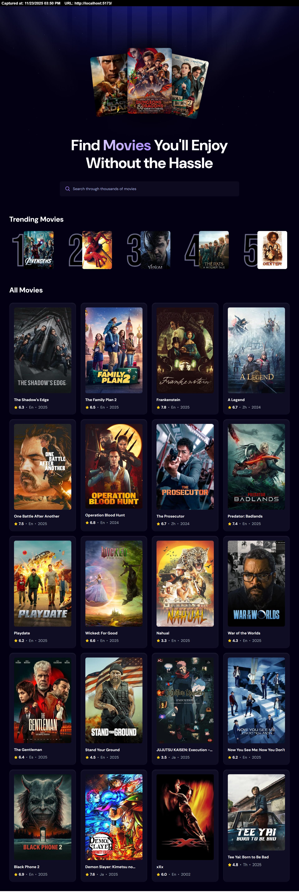

# React Movie App

My first official React project 😁  
This is a project that uses the TMDB official API to deliver movies straight to users  
It will deployed and available on GitHub Pages [here](https://dannys-domain-movies.netlify.app)
<br><br>



## Project Overview
1. A home area
2. A search box, that fetches and renders movie on change
   1. It uses a ```debouncedSearchTerm``` to avoid over usgae of API
   2. it utilizes the ```useDebounce``` hook from ```react-use``` package
3. A trending movies section
   1. User searches are stored and tracked by highest count, rendered on the Trending Movies sections
4. Zustand for state management, ChatGPT recommends Redux so I'll soon migrate from this
5. A ```trendingMovies``` store that is persisted on localStorage using the ```persist``` package from ```zustand/middleware```
6. A custom ```useMoviesFetch``` hook that handles movie fetching and search feature
7. A ```tmdb``` axios instance that handles making of fetch requests

## Technologies Used
- vite + react
- react-use
- axios
- tailwindcss
- zustand
- gh-pages